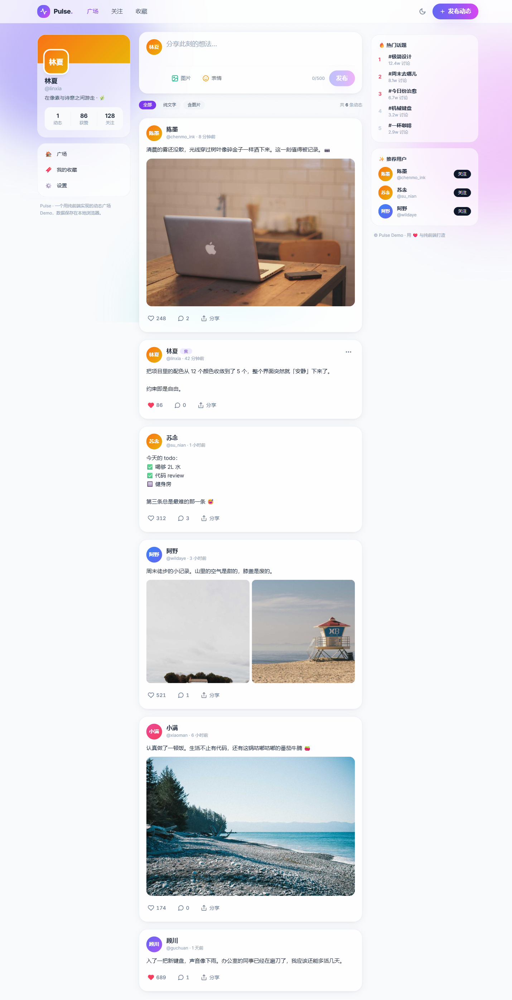

# Pulse · 动态广场 ✨

一个动态 / 博客展示页面，纯前端实现（HTML / CSS / 原生 JS + Tailwind Play CDN），数据保存在浏览器 `localStorage`，无需后端、无需构建。



## ✨ 功能

- **发布动态**：支持**文字**与**图片**（多图，最多 4 张，发布前自动压缩）
- **展示所有人**的内容：头像、用户名、@handle、发布时间、正文、配图
- **点赞**：带心跳动画，实时计数
- **评论**：展开 / 收起，按回车发送
- **分享**：复制链接到剪贴板
- **删除**自己的动态（⋯ 菜单）
- **筛选**：全部 / 纯文字 / 含图片
- **深色 / 浅色主题**切换，自动跟随系统并记忆偏好
- **响应式三栏布局**：用户卡片 + 动态流 + 热门 / 推荐侧栏（移动端自动收起）
- 毛玻璃、渐变光斑、骨架屏、轻提示 Toast、图片大图预览等细节

## 🚀 运行

无需构建，任选一种方式启动本地服务（推荐，避免 `file://` 下 `localStorage` 的限制）：

```bash
# 方式一：Node
npm start          # 即 npx serve -l 5173 .

# 方式二：Python
npm run serve:py   # 即 python -m http.server 5173
```

然后浏览器打开 <http://localhost:5173>。

> 也可以直接双击 `index.html` 打开。多数现代浏览器可用，但 `file://` 下 `localStorage` 行为不稳定，建议用上面的本地服务。

## 🧪 重置演示数据

在浏览器控制台执行：

```js
localStorage.removeItem('pulse_state_v1'); location.reload();
```

## 📁 结构

```
index.html          页面结构 + Tailwind 配置 + 组件类
css/styles.css      动画 / 毛玻璃 / 背景光斑 / 滚动条
js/utils.js         纯工具函数（时间格式、转义、头像渐变、图片压缩、Toast）
js/store.js         种子数据 + localStorage 持久化 + 增删改查
js/ui.js            渲染动态流 / 侧栏 + 事件委托 + 局部 DOM 更新
js/app.js           启动 + 发布框 + 主题切换
代码讲解.md         新手向逐行讲解（架构、各模块、表情面板、数据流）
```

## ⚠️ 说明

本项目使用 **Tailwind Play CDN**（`cdn.tailwindcss.com`），仅用于原型 / 演示，控制台会有生产环境警告。若要用于生产，请改用 Tailwind CLI 或 PostCSS 做正式构建。

License: MIT
